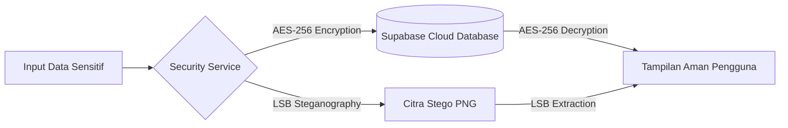

# 🕯️ Pelita - Aplikasi Pemantauan & Konsultasi Status Gizi Balita

<p align="center">
  
</p>

<p align="center">
  <strong>Solusi Cerdas Pemantauan Nutrisi, Deteksi Dini Stunting, dan Konsultasi Gizi Balita Berbasis AI</strong>
</p>

<p align="center">
  <a href="https://flutter.dev"></a>
  <a href="https://dart.dev"></a>
  <a href="https://supabase.com"></a>
  <a href="https://ai.google.dev"></a>
  <a href="https://www.figma.com/design/FhsV4fWjx3VstlG7Kd2fjh/Pelita?node-id=2052-1969"></a>
</p>

---

## 📱 Tampilan Antarmuka Aplikasi (UI Showcase)

Berikut adalah beberapa tangkapan layar antarmuka aplikasi **Pelita** yang dirancang secara modern, responsif, dan ramah pengguna (*user-friendly*):

<table align="center" width="100%">
  <tr>
    <td align="center" width="25%">
      
      <br/><br/>
      <b>🏠 Beranda Utama</b>
      <br/>
      <sub>Ringkasan profil balita, kalkulator cepat, & artikel gizi</sub>
    </td>
    <td align="center" width="25%">
      
      <br/><br/>
      <b>📏 Cek Status Gizi</b>
      <br/>
      <sub>Form input umur, berat, tinggi, & jenis kelamin</sub>
    </td>
    <td align="center" width="25%">
      
      <br/><br/>
      <b>📊 Analisis Antropometri</b>
      <br/>
      <sub>Hasil IMT, BBI, energi harian, & rekomendasi</sub>
    </td>
    <td align="center" width="25%">
      
      <br/><br/>
      <b>🤖 Konsultasi AI Pelita</b>
      <br/>
      <sub>Asisten pintar interaktif tanya-jawab gizi & parenting</sub>
    </td>
  </tr>
</table>

---

## 📖 Tentang Aplikasi

**Pelita** (*Peduli Status Gizi Balita*) adalah aplikasi kesehatan *mobile* komprehensif yang dirancang untuk membantu para orang tua, kader posyandu, dan tenaga kesehatan dalam memantau tumbuh kembang serta status gizi anak secara berkala.

Dengan menggabungkan kecerdasan buatan (**Google Gemini AI**), basis data *cloud* terdesentralisasi (**Supabase**), serta perlindungan privasi data (**Kriptografi AES-256 & Steganografi Citra LSB**), Pelita hadir sebagai asisten gizi keluarga yang aman, akurat, dan dapat diakses kapan saja.

---

## ✨ Fitur-Fitur Utama

### 1. 🤖 Konsultasi Gizi AI Interaktif (Google Gemini)
* **Asisten Virtual 24/7:** Tanya jawab instan seputar pola makan anak, variasi MPASI bergizi, jadwal makan, serta tips menangani anak susah makan (*picky eater*).
* **Persona Ahli Gizi Ramah:** Respon cerdas dengan bahasa komunikatif, empatik, serta berbasis pedoman kesehatan anak terpercaya.
* **Tampilan Chat Modern:** Dilengkapi *bubble chat* intuitif, indikator pengetikan, penyesuaian otomatis terhadap keyboard dan *safe area* sistem.

### 2. 📊 Kalkulator Status Gizi & Antropometri Balita
* **Perhitungan Standar WHO/Kemenkes:** Menghitung Indeks Massa Tubuh (IMT), Berat Badan Ideal (BBI), dan estimasi Kebutuhan Energi Harian (kkal/hari).
* **Klasifikasi Status Gizi:** Mengelompokkan status gizi anak ke dalam kategori resmi: *Gizi Buruk, Gizi Kurang, Gizi Baik/Normal, Berisiko Gizi Lebih, atau Obesitas*.
* **Rekomendasi Terarah:** Menyajikan saran nutrisi dan langkah penanganan praktis yang disesuaikan dengan kondisi fisik anak.

### 3. 📚 Edukasi & Artikel Kesehatan Balita
* **Informasi Terverifikasi:** Panduan gizi seimbang, pentingnya ASI eksklusif, pencegahan stunting, serta rekomendasi menu bergizi.
* **Detail Interaktif:** Navigasi artikel dengan tipografi yang nyaman dibaca dan ilustrasi pendukung yang menarik.

### 4. 🕒 Riwayat Perkembangan Cloud (Supabase PostgreSQL)
* **Penyimpanan Otomatis:** Setiap hasil penimbangan tersimpan secara *real-time* ke basis data Supabase (`history_gizi`).
* **Rekam Jejak Tumbuh Kembang:** Memantau tren kenaikan berat dan tinggi badan balita dari waktu ke waktu secara kronologis.

### 5. 🔐 Keamanan Data (Kriptografi AES-256 & Steganografi LSB)
* **Enkripsi AES-256-CBC:** Data sensitif pengguna (seperti profil dan catatan pribadi) diamankan sebelum disimpan ke basis data.
* **Steganografi Citra Digital (LSB):** Fitur penyisipan pesan rahasia ke dalam saluran warna citra digital (*Least Significant Bit*) yang tidak terlihat secara kasat mata, lengkap dengan modul ekstraksi/dekripsi pesan.

### 6. ⚡ Autentikasi Modern & Auto-Login
* **Supabase Auth:** Registrasi akun, validasi kata sandi, dan fitur pemulihan akun (*Lupa Kata Sandi*).
* **Auto-Login:** Sesi login pengguna tersimpan secara aman di memori lokal (*SharedPreferences*), memungkinkan akses instan ke Beranda tanpa perlu login berulang.

---

## 🛠️ Arsitektur & Teknologi

| Komponen | Teknologi / Pustaka | Deskripsi |
| :--- | :--- | :--- |
| **Framework** | [Flutter](https://flutter.dev) (Dart SDK v3.9+) | Pengembangan antarmuka multiplatform cepat & responsif |
| **Backend & Auth** | [Supabase](https://supabase.com) (`supabase_flutter`) | Otentikasi pengguna, PostgreSQL Database, & Session Storage |
| **Artificial Intelligence** | [Google Generative AI](https://pub.dev/packages/google_generative_ai) | Integrasi model Gemini untuk konsultasi nutrisi balita |
| **Keamanan & Kriptografi** | `encrypt` & `crypto` | Enkripsi simetris AES-256 CBC dengan PKCS7 padding |
| **Pengolahan Citra** | `image`, `image_picker`, `gal` | Pengolahan LSB citra digital dan penyimpanan galeri |
| **Penyimpanan Lokal** | `shared_preferences` | Manajemen preferensi lokal dan status autentikasi |
| **Desain UI/UX** | Material 3 & Figma | Skema warna Teal ramah anak ([Desain Figma](https://www.figma.com/design/FhsV4fWjx3VstlG7Kd2fjh/Pelita?node-id=2052-1969)) |

---

## 📁 Struktur Direktori Proyek

```text
Aplikasi Pelita/
├── android/                        # Konfigurasi native Android & Gradle
├── Asset/                          # Aset visual aplikasi
│   ├── Logo/                       # Logo resmi Pelita
│   ├── Menukalkulator/             # Ikon & ilustrasi kalkulator gizi
│   ├── menuartikel/                # Gambar ilustrasi artikel edukasi
│   ├── menuutama/                  # Ikon navigasi beranda
│   ├── onboarding/                 # Ilustrasi halaman onboarding
│   └── avatars...                  # Aset avatar pengguna
├── lib/                            # Kode sumber aplikasi Flutter
│   ├── main.dart                   # Titik masuk aplikasi, inisialisasi & routing
│   ├── api_config.dart             # Konfigurasi API Key (Gemini & Supabase)
│   ├── home_screen.dart            # Dashboard beranda & menu navigasi
│   ├── kalkulator_gizi_screen.dart # Form input antropometri balita
│   ├── hasil_perhitungan_screen.dart # Ringkasan evaluasi gizi (IMT, BBI, Energi)
│   ├── detail_hasil_screen.dart    # Rekomendasi medis & nutrisi lengkap
│   ├── konsultasi_screen.dart      # Chatbot konsultasi AI (Google Gemini)
│   ├── detail_artikel_screen.dart  # Halaman pembaca artikel gizi
│   ├── riwayat.dart                # Histori pemeriksaan gizi dari Supabase
│   ├── security_service.dart       # Layanan Enkripsi AES-256 & Steganografi LSB
│   ├── stego_screen.dart           # UI interaktif enkripsi/dekripsi citra stego
│   ├── login_screen.dart           # Form masuk pengguna
│   ├── register_screen.dart        # Form registrasi pengguna baru
│   ├── lupa_password_screen.dart   # Fitur reset kata sandi
│   ├── profile.dart                # Informasi akun pengguna & opsi keluar
│   ├── edit_profile_page.dart      # Ubah data nama, email, & avatar
│   ├── change_password_page.dart   # Ubah kata sandi pengguna
│   └── onboarding_screen.dart      # Pengenalan fitur untuk pengguna baru
├── tampilan UI Pelita/             # Tangkapan layar antarmuka aplikasi
│   ├── Tampilan Beranda.jpeg
│   ├── Tampilan Cek Status Gizi.jpeg
│   ├── Tampilan Hasil Perhitungan Gizi.jpeg
│   └── Tampilan Chatbot.jpeg
├── pubspec.yaml                    # Dependensi paket & deklarasi aset
└── README.md                       # Dokumentasi resmi proyek
```

---

## 🚀 Panduan Menjalankan Proyek

### 1. Prasyarat Sistem
* **Flutter SDK:** Versi 3.24.0 atau lebih baru
* **Dart SDK:** Versi 3.5.0 atau lebih baru
* **Java Development Kit (JDK):** JDK 17
* **Android Studio / VS Code** dengan ekstensi *Flutter & Dart* terpasang

### 2. Langkah Instalasi

1. **Clone Repositori:**
   ```bash
   git clone https://github.com/MuhamadHata/Projek-Aplikasi-Pelita.git
   cd Projek-Aplikasi-Pelita
   ```

2. **Unduh Dependensi:**
   ```bash
   flutter pub get
   ```

3. **Konfigurasi API Key:**
   Pastikan file `lib/api_config.dart` sudah terisi dengan kredensial yang valid:
   ```dart
   class ApiConfig {
     static const String geminiApiKey = 'ISI_DENGAN_GEMINI_API_KEY_ANDA';
   }
   ```

4. **Jalankan Aplikasi:**
   ```bash
   flutter run
   ```

5. **Build APK Release (Siap Install):**
   ```bash
   flutter build apk --release
   ```
   *File APK hasil build akan tersimpan di: `build/app/outputs/flutter-apk/app-release.apk`*

---

## 🔒 Alur Keamanan & Privasi



1. **AES-256 Simetris:** Data penting pengguna dienkripsi dengan kunci rahasia sebelum transit dan penyimpanan.
2. **Steganografi LSB (Least Significant Bit):** Pesan rahasia disisipkan pada bit terendah kanal warna citra PNG sehingga perubahan visual tidak dapat dibedakan oleh mata manusia.

---

## 👤 Pengembang (Author)

**Muhamad Hata**  
*Mahasiswa Teknik Informatika & Mobile Application Developer*  
* 🐙 **GitHub:** [@MuhamadHata](https://github.com/MuhamadHata)
* 🎨 **Desain UI/UX (Figma):** [Figma Pelita App](https://www.figma.com/design/FhsV4fWjx3VstlG7Kd2fjh/Pelita?node-id=2052-1969)

---

<p align="center">
  Dibuat dengan ❤️ untuk mendukung pemantauan gizi optimal dan pencegahan stunting pada balita Indonesia.
</p>
